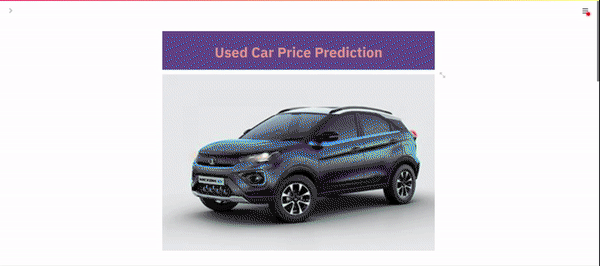

# Used Car Price Prediction - This is a prediction model deployed with flutter

🚗🚙🚓🚕🚐

  

• This repository consists of files required to deploy a ___Machine Learning Web App___ created with ___Streamlit___ on ___Heroku___ platform.

• Applied Random-forest for better accuracy.

• If you want to view the deployed model, click on the following link: 
Deployed at: _https://used-car-price-pred.herokuapp.com/_

This is only for educational and project purpose... Cheers

• Please do ⭐ the repository, if it helped you in anyway.

• A glimpse of the web app:

